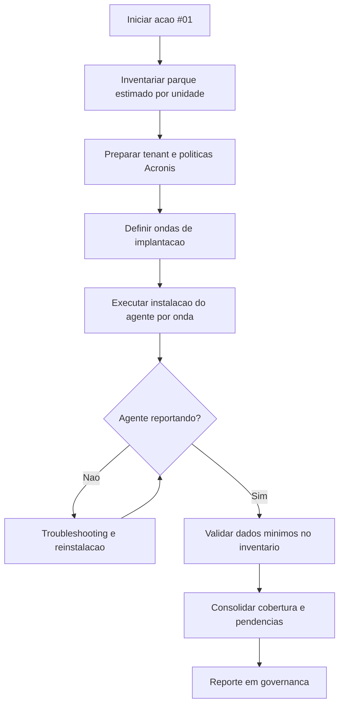
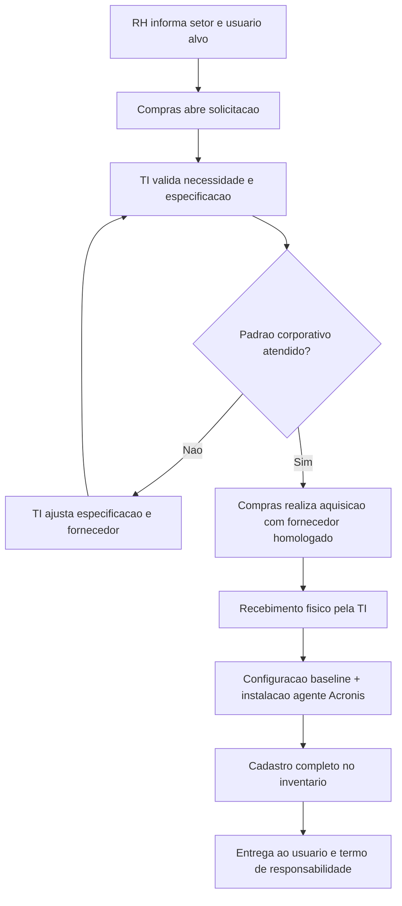
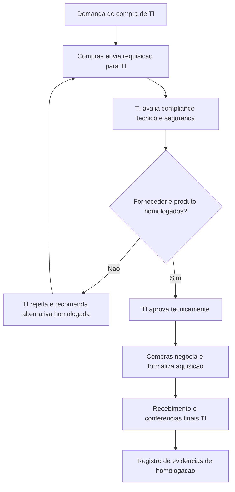

# Plano de Acao #01

## Inventario de HW/SW com Acronis

## 1) Identificacao do Plano

- Codigo da acao: #01
- Frente: Ativos e Conformidade
- Base metodologica: ITIL 4 + DMAIC + 5W2H
- Ferramenta oficial de inventario: Acronis
- Responsavel primario: Marcone
- Areas envolvidas: TI, Compras, RH, Gestores de Area, Financeiro
- Prioridade: Alta
- Relacao com outras acoes: #01 habilita #02 e #04

## 2) Objetivo do Plano

Implantar um processo corporativo de inventario de ativos de TI com Acronis, garantindo descoberta, cadastro, atualizacao continua e rastreabilidade auditavel de todas as maquinas elegiveis, incluindo padrao formal para novas aquisicoes e fluxo conjunto entre TI, Compras e RH.

## 3) Referencia ITIL Aplicada

- ITAM: controle do ciclo de vida de ativos e custeio associado.
- SACM: consistencia entre inventario logico e realidade fisica.
- Service Request Management: fluxo formal de solicitacao de novos equipamentos.
- Supplier Management: homologacao de fornecedores e compliance tecnico.
- Information Security Management: baseline de seguranca e conformidade minima de endpoint.

## 4) Escopo

### Inclui

- Implantacao do agente Acronis em todas as maquinas elegiveis.
- Descoberta e consolidacao de inventario de hardware e software.
- Definicao de padrao de dados obrigatorios no inventario.
- POP de novas maquinas (entrada de ativo no ambiente).
- POP de homologacao de compras com TI como aprovador tecnico obrigatorio.
- Integracao operacional com RH para vinculo setor/usuario.

### Nao inclui

- Regularizacao contratual de licencas (acao #05).
- Etiquetagem fisica e ciclo de vida completo (acao #03).
- Tratamento de Shadow IT em rede (acoes #19 e #24).

## 5) Ciclo DMAIC

### D - Define (Definir)

- Problema: inexistencia de inventario corporativo confiavel e fluxo formal entre TI, Compras e RH para entrada de novos ativos.
- Meta primaria: 100% das maquinas elegiveis com agente Acronis ativo e reportando.
- Meta secundaria: 100% das compras de TI com aprovacao tecnica previa da TI.
- Clientes do processo: TI, Auditoria, Diretoria, Compras, RH, gestores de area.
- CTQs: cobertura do agente, acuracia dos dados, tempo de atualizacao, aderencia ao fluxo de compras.

### M - Measure (Medir)

- Baseline inicial:
  - total de maquinas estimadas por unidade;
  - percentual sem inventario;
  - percentual sem dono/setor definido;
  - percentual de compras sem aprovacao tecnica da TI.
- Indicadores semanais:
  - cobertura do agente Acronis;
  - taxa de falha de instalacao;
  - tempo medio entre compra e cadastro no inventario.

### A - Analyze (Analisar)

- Causas-raiz provaveis:
  - ausencia de ferramenta padrao centralizada;
  - compra descentralizada sem gate tecnico;
  - onboarding sem dados completos de setor e usuario;
  - falta de padrao minimo de configuracao e compliance de endpoint.
- Impactos:
  - risco de nao conformidade na auditoria;
  - ativos fora de controle patrimonial;
  - aumento de incidentes e tempo de suporte.

### I - Improve (Melhorar)

- Implantar agente Acronis em ondas por unidade/setor.
- Padronizar pacote de instalacao (silent install, tags, tenant/politica correta).
- Criar POP de novas maquinas com gate RH -> Compras -> TI.
- Criar POP de homologacao de compras com criterios de compliance corporativo.
- Definir checklist minimo para liberacao de equipamento ao usuario final.

### C - Control (Controlar)

- Painel mensal de cobertura e qualidade do inventario.
- Auditoria amostral mensal (fisico x inventario logico).
- Bloqueio de aquisicao sem aprovacao tecnica da TI.
- Revisao trimestral dos POPs e criterios de homologacao.

## 6) Plano 5W2H

| 5W2H                    | Definicao para a acao #01                                                                                    |
| ----------------------- | ------------------------------------------------------------------------------------------------------------ |
| What (O que)            | Implantar inventario corporativo de HW/SW com Acronis e formalizar fluxo de aquisicao com TI, Compras e RH.  |
| Why (Por que)           | Garantir governanca de ativos, conformidade de auditoria e previsibilidade operacional em grande escala.     |
| Where (Onde)            | Todas as unidades e setores com ativos de TI elegiveis.                                                      |
| When (Quando)           | Inicio imediato, com ondas semanais ate cobertura total.                                                     |
| Who (Quem)              | TI (dono tecnico), Compras (execucao de aquisicao), RH (vinculo setor/usuario), Gestores (validacao local).  |
| How (Como)              | Deploy do agente Acronis + POP de novas maquinas + POP de homologacao de compras + controle por indicadores. |
| How much (Quanto custa) | Licenciamento Acronis, horas tecnicas de deploy e governanca, treinamento operacional das areas.             |

## 7) Fluxos

### 7.1 Fluxo de Implantacao do Acronis (Projeto)

### 7.2 Fluxo Operacional de Novas Maquinas (RH + Compras + TI)

### 7.3 Fluxo de Homologacao com Compras (Gate Tecnico TI)

## 8) Passos Tecnicos - Instalacao do Agente Acronis em Todas as Maquinas

### 8.1 Pre-requisitos

- Conta administrativa local ou credencial de deploy remoto.
- URL/tenant Acronis e pacote de instalacao oficial.
- Portas de saida liberadas para comunicacao do agente.
- Politica de endpoint definida (tags, unidade, setor, owner).

### 8.2 Estrategia recomendada de deploy

- Onda 1: TI e usuarios piloto.
- Onda 2: administrativo e backoffice.
- Onda 3: operacao e filiais.
- Onda 4: excecoes e maquinas com falha.

### 8.3 Procedimento padrao por maquina

1. Identificar hostname, unidade, setor e usuario.
2. Verificar requisitos minimos do sistema e conectividade.
3. Instalar agente Acronis em modo silencioso (padrao corporativo).
4. Confirmar servico ativo e telemetria reportando no console.
5. Aplicar tags e metadata obrigatoria.
6. Validar coleta de hardware/software e timestamp de ultimo check-in.
7. Registrar evidencias de sucesso ou falha.

### 8.4 Criterios de aceite tecnico

- Agente instalado e saudavel.
- Check-in no console em ate 30 minutos apos instalacao.
- Dados minimos preenchidos: hostname, serial, sistema operacional, unidade, setor, owner.
- Sem alertas criticos de comunicacao.

## 9) POPs vinculados

- RUN de instalacao do agente: `Entregaveis/RUN-GTI-01_Instalacao_Agente_Acronis.md`
- POP de novas maquinas: `Entregaveis/POP-GTI-01_Novas_Maquinas_RH_Compras_TI.md`
- POP de homologacao de compras: `Entregaveis/POP-GTI-01_Homologacao_Compras_e_Fornecedores.md`
- POP de software nao homologado: `Entregaveis/POP-GTI-01_Software_Nao_Homologado.md`
- Matriz de entregaveis: `Entregaveis/00_INDICE_Entregaveis.md`

## 10) Entregaveis e Evidencias para Auditoria

- Plano de implantacao por ondas.
- Relatorio de cobertura do agente Acronis por unidade/setor.
- Registro de falhas de instalacao e tratativas.
- POP de novas maquinas aprovado e em vigor.
- POP de homologacao de compras aprovado e em vigor.
- POP de software nao homologado aprovado e em vigor.
- Evidencias de aprovacao tecnica da TI nas aquisicoes.
- Evidencias de notificacao formal ao responsavel do setor e desfecho em 15 dias.
- Termos de responsabilidade assinados em casos de negativa de compra de licenca.
- Relatorio de conformidade de ativos novos com setor/usuario vinculados pelo RH.
- Dashboard executivo de indicadores da acao #01.

## 11) KPIs de Controle

- Cobertura do agente Acronis (%).
- Taxa de sucesso de instalacao em primeira tentativa (%).
- Tempo medio de onboarding de maquina (compra ate inventario ativo).
- Percentual de compras de TI com aprovacao tecnica previa (%).
- Percentual de ativos com owner/setor preenchidos (%).

## 12) Riscos e Mitigacoes

- Risco: maquinas off-line no periodo de deploy.
  - Mitigacao: janela de repescagem e rotina de reexecucao automatizada.
- Risco: compra sem gate tecnico da TI.
  - Mitigacao: politica formal com bloqueio processual em Compras.
- Risco: dados de usuario/setor incompletos.
  - Mitigacao: campo obrigatorio no handoff do RH e checklist de liberacao.
- Risco: fornecedor fora do padrao corporativo.
  - Mitigacao: lista de fornecedores homologados e revisao tecnica obrigatoria.

## 13) Criterio de Conclusao da Acao #01

A acao sera considerada concluida quando:

- cobertura do agente Acronis atingir 100% das maquinas elegiveis;
- 100% das aquisicoes novas de TI passarem por aprovacao tecnica da TI;
- POPs de novas maquinas e homologacao de compras estiverem publicados e aplicados;
- inventario apresentar completude minima de 98% nos campos obrigatorios.

## 14) Proximo Encadeamento

Com a acao #01 estabilizada, seguir para:

- #02 Codigo definitivo do inventario.
- #03 Etiquetagem fisica e ciclo de vida.
- #04 Homologacao de sistemas ativos.
