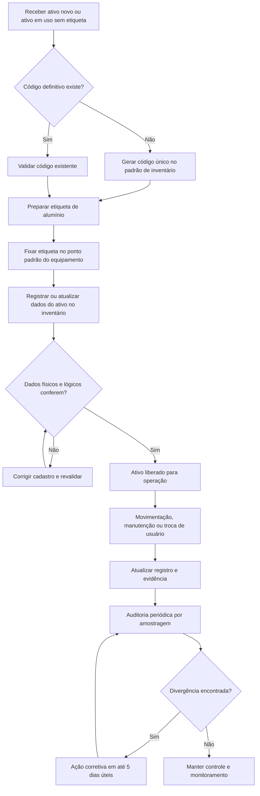
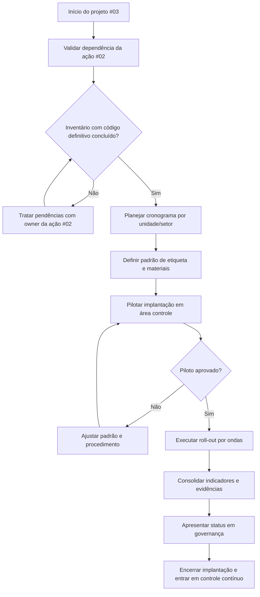
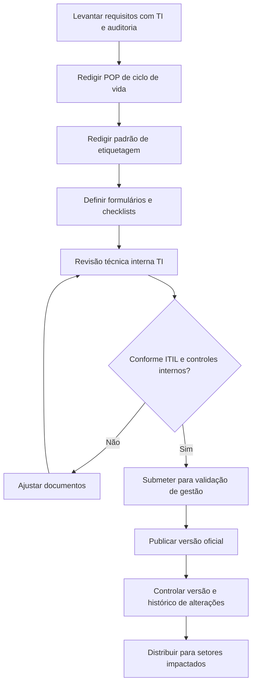
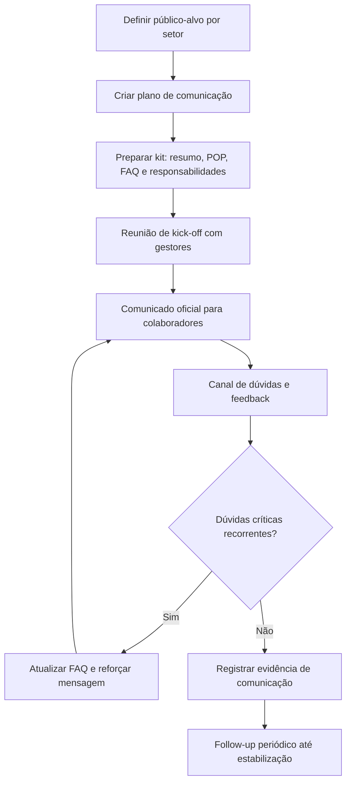
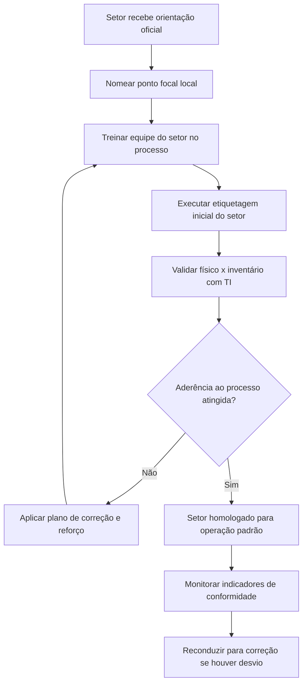

# Plano de Ação #03

## Implantar ciclo de vida + etiquetagem física

## 1) Identificação do Plano

| Campo                    | Valor                                                              |
| ------------------------ | ------------------------------------------------------------------ |
| Código da ação           | #03                                                                |
| Frente                   | Ativos & Conformidade                                              |
| Base metodológica        | ITIL 4 · ITAM / SACM / Change Enablement + DMAIC + 5W2H           |
| Responsável primário     | Marcone                                                            |
| Aprovação                | Kedymma / Fábio                                                    |
| Dependência obrigatória  | #02 — inventário com código definitivo concluído                   |
| Dependência secundária   | #01 — varredura Acronis consolidada (fonte de dados de entrada)    |
| Prioridade               | Alta — base estrutural da rastreabilidade de ativos para auditoria |
| Início previsto          | Imediatamente após conclusão de #02                                |
| Data-alvo                | 13/07/2026                                                         |

## 2) Objetivo do Plano

Garantir que 100% dos ativos de TI elegíveis estejam identificados fisicamente por etiqueta permanente e com ciclo de vida registrado no inventário — cobrindo aquisição, uso, movimentação, manutenção e descarte — de forma que qualquer ativo possa ser localizado, rastreado e auditado sem depender de memória individual ou controle informal.

## 3) Referência ITIL Aplicada

- **ITAM (IT Asset Management):** prática central. Define o ciclo de vida completo do ativo (aquisição → uso → movimentação → manutenção → descarte), os padrões de identificação física e a responsabilidade por cada item ao longo do tempo. É a base de tudo que esta ação constrói.
- **SACM (Service Configuration and Asset Management):** garante a integridade entre o ativo físico (etiqueta, localização, estado real) e o registro lógico no inventário. Sem SACM aplicado, o CMDB se desatualiza a cada movimentação não registrada — tornando o inventário inútil para auditoria.
- **Change Enablement:** toda movimentação, troca de usuário ou manutenção de ativo é uma mudança que precisa ser registrada formalmente. O procedimento de atualização obrigatória após cada evento é Change Enablement aplicado ao contexto de ativos físicos.

## 4) Escopo

### Inclui

- Definição e publicação dos status oficiais do ciclo de vida: **Em uso**, **Em manutenção**, **Reserva** e **Descarte**.
- Padrão definitivo de etiqueta: material alumínio resistente, código único, posição de fixação definida por tipo de equipamento e critério de substituição em caso de dano.
- POP de etiquetagem e atualização obrigatória de inventário após movimentação, troca de usuário e manutenção.
- Mutirão de regularização por ondas: Matriz → Vitória → Vila Velha, com checklist de aceite por unidade.
- Rotina de auditoria por amostragem com geração de evidência periódica e ação corretiva em até 5 dias úteis.

### Não inclui

- **Aquisição de ferramenta de discovery automático** — avaliada como melhoria futura fora do horizonte da auditoria de 13/07/2026; o mapeamento braçal (ação #24) supre a necessidade no curto prazo.
- **Regularização de licenças de software** — escopo da ação #05, que corre em paralelo e compartilha a base do inventário gerada por #02.
- **Identificação e quarentena de Shadow IT** — ações #19 e #24. Dependem desta ação: o SACM atualizado é a referência que permite identificar o que está "fora do padrão".

## 5) Ciclo DMAIC

### D - Define (Definir)

- Problema: ativos sem rastreabilidade uniforme e sem identificação física padronizada.
- Meta: 100% dos ativos elegíveis com etiqueta validada e registro atualizado.
- Clientes do processo: TI, auditoria interna, diretoria, áreas usuárias.
- Critérios críticos (CTQ): legibilidade, unicidade do código, aderência de localização, histórico de movimentação.

### M - Measure (Medir)

- Levantar baseline:
  - Percentual de ativos sem etiqueta.
  - Percentual de ativos com divergência entre físico e registro.
  - Tempo médio para localizar ativo por solicitação.
- Criar planilha de medição inicial e checkpoints semanais.

### A - Analyze (Analisar)

- Causas raiz prováveis:
  - Ausência de padrão único de identificação física.
  - Movimentações sem registro formal.
  - Falta de ponto de controle na entrada e saída de ativos.
- Análise de risco:
  - Perda patrimonial.
  - Não conformidade em auditoria.
  - Aumento de tempo de suporte e inventário.

### I - Improve (Melhorar)

- Implantar padrão de etiqueta de alumínio com código único.
- Publicar POP do ciclo de vida com responsáveis por etapa.
- Executar mutirão de regularização por unidade/setor.
- Incluir checagem obrigatória em onboarding/offboarding e manutenção.

### C - Control (Controlar)

- Auditoria interna mensal por amostragem.
- Indicadores de conformidade acompanhados em reunião de governança.
- Ação corretiva em até 5 dias úteis para divergências.
- Revisão trimestral do padrão de etiquetagem e procedimento.

## 6) Plano 5W2H

| 5W2H                    | Definição para a ação #03                                                                                                  |
| ----------------------- | -------------------------------------------------------------------------------------------------------------------------- |
| What (O que)            | Implantar processo de ciclo de vida de ativos com etiquetagem física padronizada e rastreável.                             |
| Why (Por que)           | Garantir conformidade, reduzir risco patrimonial e gerar evidência auditável de governança de ativos.                      |
| Where (Onde)            | Todas as unidades e áreas com ativos de TI (incluindo filiais).                                                            |
| When (Quando)           | Início imediato, com estabilização antes da auditoria de 13/07/2026.                                                       |
| Who (Quem)              | Marcone (owner), equipe TI (execução), gestores locais (validação de localização), diretoria (patrocínio).                 |
| How (Como)              | POP de ciclo de vida, padrão de etiqueta, inventário de regularização, conciliação físico x registro e rotina de controle. |
| How much (Quanto custa) | Baixo a moderado: etiquetas de alumínio, insumos de fixação, horas de execução e conferência.                              |

## 7) Gráfico de Fluxo (Processo Operacional)

## 7.1) Fluxo de Implantação (Projeto)

## 7.2) Fluxo de Criação e Aprovação da Documentação

## 7.3) Fluxo de Comunicação do Processo

## 7.4) Fluxo de Adoção pelos Setores

## 8) Entregáveis e Evidências para Auditoria

- Plano de implantação por ondas (unidade/setor, datas, responsáveis e critérios de aceite).
- Cronograma executivo da ação #03 com baseline e replanejamentos registrados.
- POP do ciclo de vida de ativos aprovado e publicado (com controle de versão).
- Padrão de etiqueta definido (modelo, posição, regra de codificação e critérios de substituição).
- Instrução de trabalho para etiquetagem física (passo a passo operacional).
- Checklist oficial de movimentação/troca de usuário com atualização obrigatória no inventário.
- Matriz RACI da ação (TI, gestores setoriais, diretoria e apoio administrativo).
- Relatório de cobertura de etiquetagem por unidade, setor e tipo de ativo.
- Relatório de ativos não etiquetados com plano de regularização e prazo.
- Amostra fotográfica de ativos etiquetados (antes/depois por unidade).
- Registro de conciliação físico x inventário com taxa de divergência por rodada.
- Registro de não conformidades, ações corretivas, responsável e prazo de fechamento.
- Kit de comunicação oficial (comunicado, resumo executivo, FAQ e instruções para gestores).
- Evidências de comunicação por setor (lista de distribuição, atas, prints ou protocolo de envio).
- Registro de sessões de alinhamento com gestores de área (pauta, presença e decisões).
- Lista de pontos focais nomeados por setor e termo de responsabilidade funcional.
- Evidências de treinamento por setor (presença, conteúdo aplicado e avaliação rápida).
- Termo de homologação de adoção por setor (go-live do processo local).
- Dashboard de indicadores de adoção (cobertura, acurácia, pendências e reincidência).
- Relatório de lições aprendidas do piloto e ajustes incorporados ao roll-out.

## 9) KPIs de Controle

- Cobertura de etiquetagem (%): ativos etiquetados / ativos elegíveis.
- Acurácia do inventário (%): ativos sem divergência / ativos auditados.
- Tempo de atualização de movimentação (horas).
- Taxa de reincidência de divergência por unidade.

## 10) Riscos e Mitigações

- Risco: etiqueta danificada ou removida.
  - Mitigação: padrão de material resistente e inspeção periódica.
- Risco: movimentação sem atualização de registro.
  - Mitigação: bloqueio processual (checklist obrigatório em mudança de local/usuário).
- Risco: baixa adesão das áreas.
  - Mitigação: comunicação formal + validação com gestores locais + reporte de pendências.

## 11) Critério de Conclusão da Ação #03

A ação será considerada concluída quando:

- 100% dos ativos elegíveis estiverem etiquetados.
- Inventário apresentar acurácia minima de 98% na amostragem de auditoria interna.
- Procedimento estiver publicado, em uso e com evidência de controle mensal.

## 12) Próximo Encadeamento

Após estabilizar a ação #03, usar os dados consolidados para fortalecer:

- #04 Homologação de sistemas ativos.
- #19 Tratamento de Shadow IT (quarentena e controle).
- #14 Catálogo padronizado para expansão de filiais.
