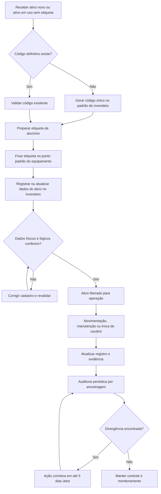

# Plano de Ação #03

## Implantar ciclo de vida + etiquetagem física

## 1) Identificação do Plano

- Código da ação: #03
- Frente: Ativos e Conformidade
- Base metodológica: ITIL 4 + DMAIC + 5W2H
- Responsável primário: Marcone
- Dependência principal: conclusão da ação #02 (inventário com código definitivo)
- Prioridade: Média (com impacto estrutural para auditoria)
- Data-alvo de estabilização: antes de 13/07/2026

## 2) Objetivo do Plano

Implantar um processo padronizado de ciclo de vida de ativos de TI, com etiquetagem física permanente em todos os equipamentos elegíveis, garantindo rastreabilidade ponta a ponta (aquisição, uso, movimentação, manutenção, descarte) e evidência auditável.

## 3) Referência ITIL Aplicada

- ITAM (IT Asset Management): governança de ativos ao longo do ciclo de vida.
- SACM (Service Configuration and Asset Management): integridade de dados entre ativo físico e registro lógico.
- Information Security Management: reforço de controle patrimonial e redução de risco de ativo não rastreado.

## 4) Escopo

### Inclui

- Definição de status de ciclo de vida do ativo.
- Padrão de etiqueta (material, conteúdo, legibilidade e posição de fixação).
- Procedimento de registro e atualização após movimentações.
- Inventário físico inicial de regularização.
- Rotina de conferência periódica com trilha de evidência.

### Não inclui

- Compra de ferramenta nova de discovery (fora da ação #03).
- Regularização de licenças de software (ação #05).
- Tratamento de Shadow IT (ações #19 e #24).

## 5) Ciclo DMAIC

### D - Define (Definir)

- Problema: ativos sem rastreabilidade uniforme e sem identificação física padronizada.
- Meta: 100% dos ativos elegíveis com etiqueta validada e registro atualizado.
- Clientes do processo: TI, auditoria interna, diretoria, áreas usuárias.
- Critérios críticos (CTQ): legibilidade, unicidade do código, aderência de localização, histórico de movimentação.

### M - Measure (Medir)

- Levantar baseline:
  - Percentual de ativos sem etiqueta.
  - Percentual de ativos com divergência entre físico e registro.
  - Tempo médio para localizar ativo por solicitação.
- Criar planilha de medição inicial e checkpoints semanais.

### A - Analyze (Analisar)

- Causas raiz prováveis:
  - Ausência de padrão único de identificação física.
  - Movimentações sem registro formal.
  - Falta de ponto de controle na entrada e saída de ativos.
- Análise de risco:
  - Perda patrimonial.
  - Não conformidade em auditoria.
  - Aumento de tempo de suporte e inventário.

### I - Improve (Melhorar)

- Implantar padrão de etiqueta de alumínio com código único.
- Publicar POP do ciclo de vida com responsáveis por etapa.
- Executar mutirão de regularização por unidade/setor.
- Incluir checagem obrigatória em onboarding/offboarding e manutenção.

### C - Control (Controlar)

- Auditoria interna mensal por amostragem.
- Indicadores de conformidade acompanhados em reunião de governança.
- Ação corretiva em até 5 dias úteis para divergências.
- Revisão trimestral do padrão de etiquetagem e procedimento.

## 6) Plano 5W2H

| 5W2H                    | Definição para a ação #03                                                                                                  |
| ----------------------- | -------------------------------------------------------------------------------------------------------------------------- |
| What (O que)            | Implantar processo de ciclo de vida de ativos com etiquetagem física padronizada e rastreável.                             |
| Why (Por que)           | Garantir conformidade, reduzir risco patrimonial e gerar evidência auditável de governança de ativos.                      |
| Where (Onde)            | Todas as unidades e áreas com ativos de TI (incluindo filiais).                                                            |
| When (Quando)           | Início imediato, com estabilização antes da auditoria de 13/07/2026.                                                       |
| Who (Quem)              | Marcone (owner), equipe TI (execução), gestores locais (validação de localização), diretoria (patrocínio).                 |
| How (Como)              | POP de ciclo de vida, padrão de etiqueta, inventário de regularização, conciliação físico x registro e rotina de controle. |
| How much (Quanto custa) | Baixo a moderado: etiquetas de alumínio, insumos de fixação, horas de execução e conferência.                              |

## 7) Gráfico de Fluxo (Processo Operacional)

## 8) Entregáveis e Evidências para Auditoria

- POP do ciclo de vida de ativos aprovado.
- Padrão de etiqueta definido (modelo, posição, regra de codificação).
- Relatório de cobertura de etiquetagem por unidade.
- Amostra fotográfica de ativos etiquetados.
- Registro de conciliação físico x inventário.
- Registro de não conformidades e ações corretivas.

## 9) KPIs de Controle

- Cobertura de etiquetagem (%): ativos etiquetados / ativos elegíveis.
- Acurácia do inventário (%): ativos sem divergência / ativos auditados.
- Tempo de atualização de movimentação (horas).
- Taxa de reincidência de divergência por unidade.

## 10) Riscos e Mitigações

- Risco: etiqueta danificada ou removida.
  - Mitigação: padrão de material resistente e inspeção periódica.
- Risco: movimentação sem atualização de registro.
  - Mitigação: bloqueio processual (checklist obrigatório em mudança de local/usuário).
- Risco: baixa adesão das áreas.
  - Mitigação: comunicação formal + validação com gestores locais + reporte de pendências.

## 11) Critério de Conclusão da Ação #03

A ação será considerada concluída quando:

- 100% dos ativos elegíveis estiverem etiquetados.
- Inventário apresentar acurácia minima de 98% na amostragem de auditoria interna.
- Procedimento estiver publicado, em uso e com evidência de controle mensal.

## 12) Próximo Encadeamento

Após estabilizar a ação #03, usar os dados consolidados para fortalecer:

- #04 Homologação de sistemas ativos.
- #19 Tratamento de Shadow IT (quarentena e controle).
- #14 Catálogo padronizado para expansão de filiais.
